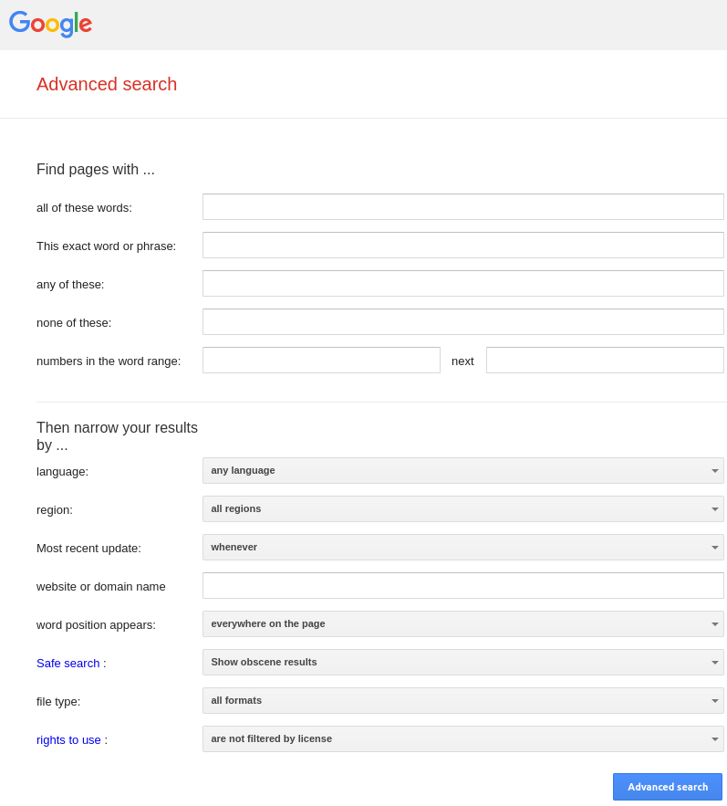
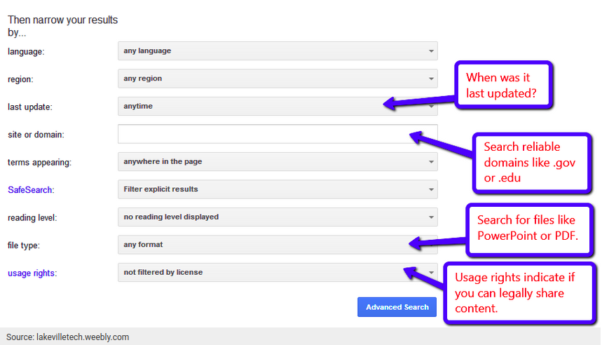
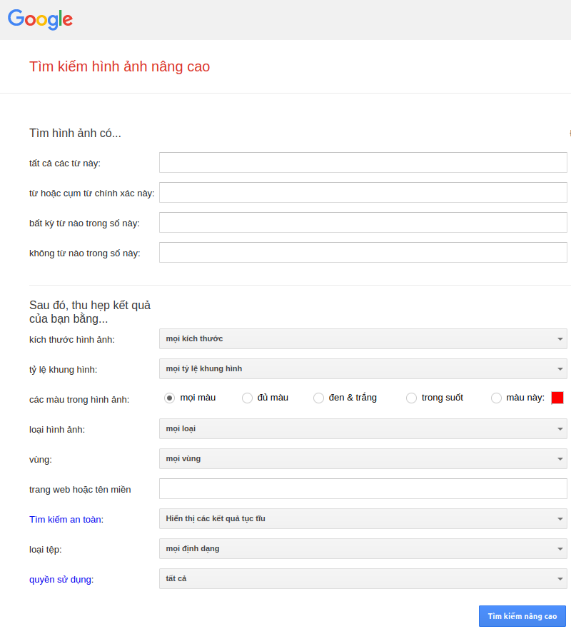
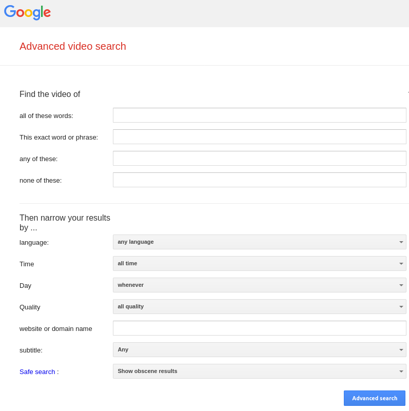

# QT11: TÌM KIẾM GOOGLE NÂNG CAO

## I. Google advanced search for webpages & files

https://www.google.com/advanced_search

Google advanced search là một phương pháp tìm kiếm thông tin chi tiết hơn trên Google. Nó sử dụng nhiều toán tử tìm kiếm của Google bao gồm các ký tự và lệnh đặc biệt - còn được gọi là "advanced operators" - vượt trội hơn tìm kiếm thông thường của Google. 

Tìm kiếm nâng cao của Google sử dụng các toán tử tìm kiếm nâng cao - hoặc các lệnh và thông số đặc biệt - sửa đổi các tìm kiếm của Google để thu hẹp các tìm kiếm thành các kết quả cụ thể và chi tiết hơn. 

### _Features_

- Tìm kiếm pages có tất cả các từ/cụm từ
- Tìm kiếm pages có chính xác các từ/cụm từ 
- Tìm kiếm pages có chứa bất kỳ từ nào trong các từ/cụm từ
- Loại bỏ pages có chứa các từ/cụng từ trong kết quả tìm kiếm 
- Số lượng từ/cụm từ cần tìm trong khoảng 

### _Filters_

Kết quả tìm kiếm có thể được lọc lại nhằm thu hẹp kết quả tìm kiếm

- Language/ngôn ngữ 
- Region/vùng miền 
- Most recent update/lần cập nhận gần nhất
- webside or domain name/trang web hoặc tên miền
- Word position appears/vị trí từ tìm kiếm xuất hiện 
- Safe search/tìm kiếm an toàn
- File stype/loại file
- Rights to use/quyền sử dụng 

### _Advanced search options_

#### 1. Tìm chính xác cho một từ hoặc cụm từ trong tiêu đề trang. 

Ví dụ: intitle:"phương pháp nghiên cứu khoa học"

#### 2. Tìm một tìm kiếm chung cho các từ và cụm từ trong tiêu đề.

Tương tự như tính năng trên, tính năng này cho phép bạn tìm tiêu đề trang bao gồm tất cả các từ hoặc cụm từ trong toán tử tìm kiếm. 

Ví dụ: allintitle:"phương pháp nghiên cứu khoa học"

#### 3. Tìm một từ hoặc cụm từ đối sánh chính xác trong URL

Tìm các từ hoặc cụm từ khớp chính xác trong một URL

Ví dụ: inurl:"phương pháp nghiên cứu khoa học" inurl:2021 

#### 4. Tìm URL cho một từ khóa cụ thể 

Thay vì thực hiện nhiều tìm kiếm URL cho một từ khóa nhất định đang tìm kiếm, chức năng này cho phép tìm tất cả các URL có liên quan đến từ khóa mong muốn.

Ví dụ: allinurl:"phương pháp nghiên cứu khoa học"

#### 5. Xác định các từ khóa trong nội dung hoặc văn bản tài liệu 

Tìm các trang web hoặc tài liệu có chứa một từ khóa cụ thể

Ví dụ: intext:"phương pháp nghiên cứu khoa học"

#### 6. Tìm nhiều từ khóa có trong nội dung hoặc văn bản tài liệu 

Định vị các trang web hoặc tài liệu có chứa nhiều hơn một trong các từ khóa 

Ví dụ: allintext:"phương pháp nghiên cứu khoa học"

#### 7. Định vị các tệp cụ thể có chứa cụm từ tìm kiếm

Tìm và tải xuống tài liệu (ví dụ: các loại tệp như PDF, PPT, DOC, XLS, TXT, v.v.) có chứa từ khóa. 

Ví dụ: "phương pháp nghiên cứu khoa học" filetype:pdf

## II. Advanced image search

https://www.google.com/advanced_image_search

## III. Advanced videos search

https://www.google.com/advanced_video_search

## IV. Advanced books search

https://books.google.com/advanced_book_search?hl=en

## References

https://static.googleusercontent.com/media/www.google.com/en//pdf/GoogleSearchGuide-back.pdf

https://keywordtool.io/blog/google-advanced-search/

https://support.google.com/websearch/answer/35890?co=GENIE.Platform%3DDesktop&hl=en&oco=0#zippy=%2Cfor-webpages-files%2Cfor-images%2Cfor-videos%2Cfor-books
